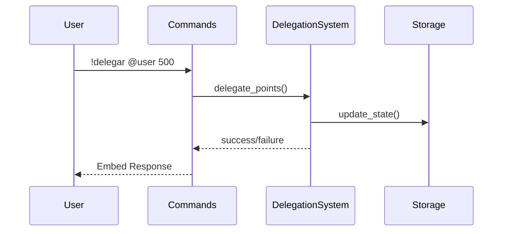
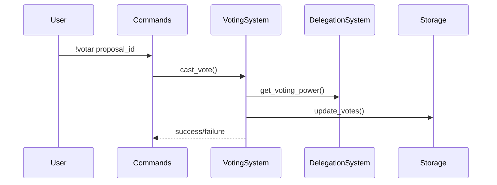

# Arquitectura Técnica 🏛️

## Componentes Core

### 1. DelegationSystem
```python
class DelegationSystem:
    def delegate_points(from_id: str, to_id: str, points: int) -> bool
    def revoke_delegation(from_id: str, to_id: str) -> bool
    def calculate_voting_power(voter_id: str) -> tuple[int, int]
```

### 2. VotingSystem
```python
class VotingSystem:
    def create_proposal(author_id: str, title: str) -> str
    def add_article(proposal_id: str, content: str) -> bool
    def cast_vote(voter_id: str, proposal_id: str, points: int) -> bool
```

### 3. Visualization
```python
class VoterVisualization:
    def generate_tree_visualization() -> str
    def get_consensus_visualization(votes: int, total: int) -> Dict[str, ConsensusMetric]
```

## Flujos de Datos

### Delegación


### Votación


## Implementación Matemática

### 1. Cálculo de Consenso
- **Inmediato**: H₁₀ = 1 - log₁₀(|V_sí - 50|)/log₁₀(50)
- **Largo Plazo**: Hₑ = 1 - ln(|V_sí - 50|)/ln(50)
- **Incertidumbre**: Hₛ = -(p × log₂(p) + q × log₂(q))

### 2. Detección de Ciclos
```python
def detect_cycles(graph: Dict[str, List[str]]) -> List[List[str]]:
    visited = set()
    path = []
    cycles = []
    
    def dfs(node: str):
        if node in path:
            cycle_start = path.index(node)
            cycles.append(path[cycle_start:])
            return
        
        path.append(node)
        for neighbor in graph[node]:
            if neighbor not in visited:
                dfs(neighbor)
        path.pop()
    
    for node in graph:
        if node not in visited:
            dfs(node)
    
    return cycles
```

### 3. Persistencia
- Formato JSON para estado
- Estructura atómica para updates
- Backup incremental cada 10 min

## API Interna

### DelegationSystem
```typescript
interface Delegation {
    points: number;
    subdelegable: boolean;
    timestamp: number;
}

interface Voter {
    base_points: number;
    available_points: number;
    delegations: Record<string, Delegation>;
}
```

### VotingSystem
```typescript
interface Proposal {
    id: string;
    author: string;
    title: string;
    articles: Article[];
    state: ProposalState;
    votes: Record<string, number>;
}

enum ProposalState {
    DRAFT,
    ACTIVE,
    PASSED,
    FAILED
}
```

Para consultas o contribuciones, revisa el [README.md](README.md)
