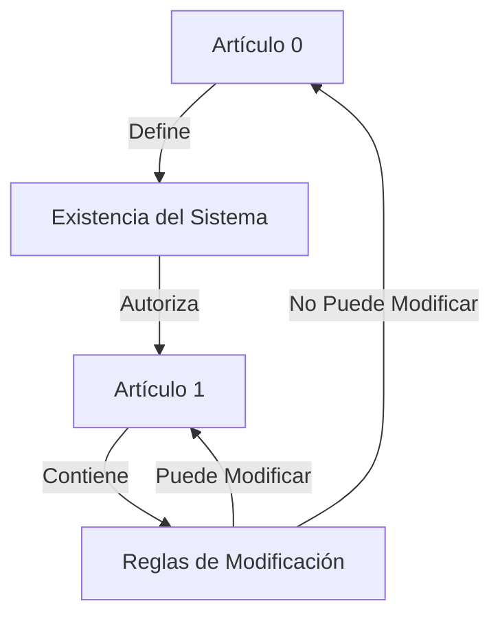
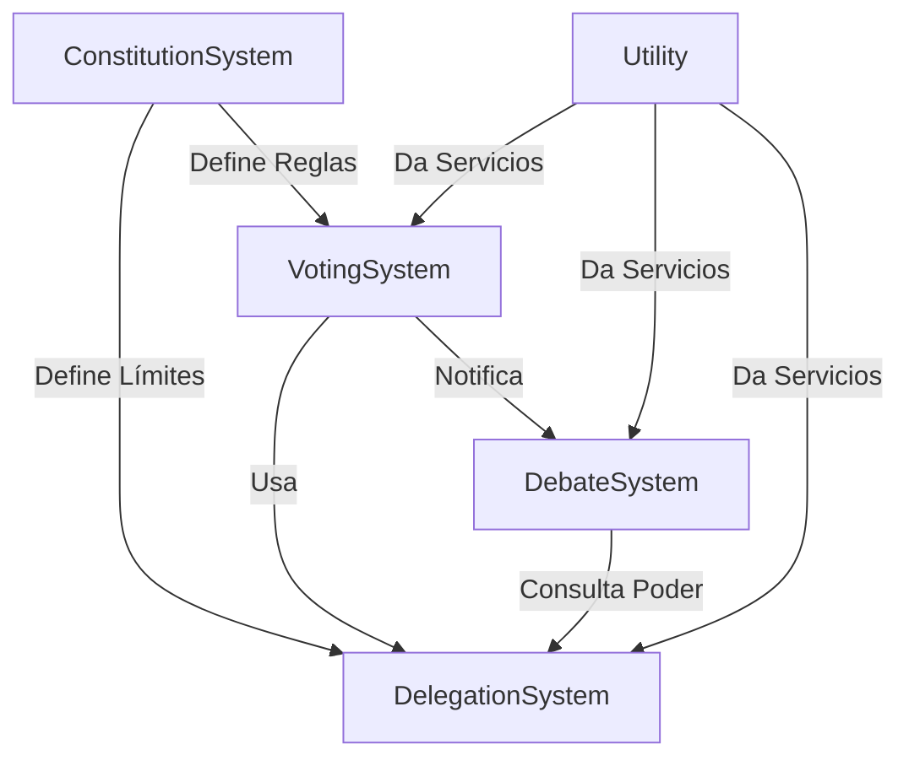
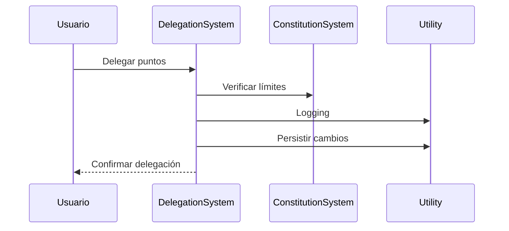
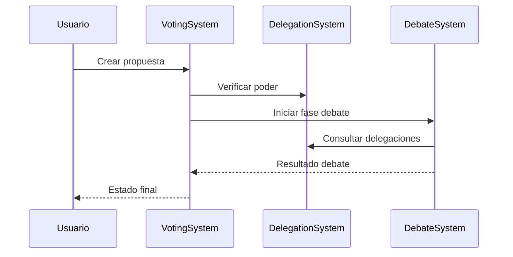
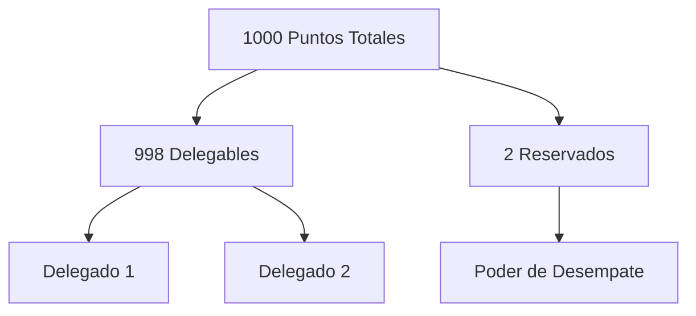
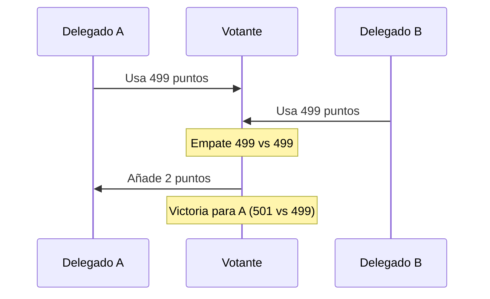
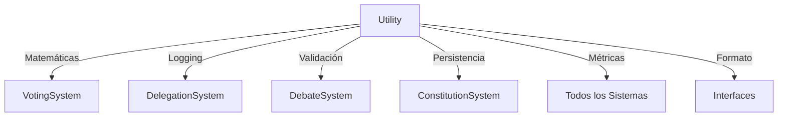

# Arquitectura Técnica 🏛️

## Recursividad Constitucional

### Artículos Fundamentales


### Paradoja del ln(0)
El Artículo 0 es matemáticamente inmutable debido a que:
1. Los votos requeridos se calculan usando ln(votos_anteriores)
2. El Artículo 0 nunca ha sido votado (0 votos)
3. ln(0) está indefinido matemáticamente
4. Por tanto, es imposible calcular los votos necesarios
5. ACTUA COMO EL LEVIATAN DE TODA LA CONSTITUCIÓN

Este es un feature, no un bug:
- Garantiza la inmutabilidad del artículo base
- No requiere restricciones artificiales
- Es matemáticamente elegante
- Protege los fundamentos del sistema

### Estructura Recursiva
```python
def puede_modificar(articulo_id: int) -> bool:
    if articulo_id == 0:
        return False  # ln(0) indefinido
    elif articulo_id == 1:
        return self_modifiable()  # Se modifica según sus propias reglas
    else:
        return check_article_one_rules()  # Sigue reglas del Artículo 1
```

# Arquitectura Técnica 🏛️

## Sistemas Core y sus Relaciones



### ConstitutionSystem
- **Rol**: Sistema fundacional que define las reglas base
- **Responsabilidades**:
  - Define límites de delegación
  - Establece reglas de votación
  - Mantiene artículos constitucionales
- **Interacciones**:
  - Proporciona reglas a VotingSystem
  - Define límites para DelegationSystem

### DelegationSystem
- **Rol**: Maneja la delegación de poder de voto
- **Responsabilidades**:
  - Gestión de puntos
  - Tracking de delegaciones
  - Detección de ciclos
- **Interacciones**:
  - Provee datos de poder a VotingSystem
  - Consulta límites a ConstitutionSystem
  - Usa Utility para operaciones comunes

### VotingSystem
- **Rol**: Gestiona propuestas y votaciones
- **Responsabilidades**:
  - Creación de propuestas
  - Conteo de votos
  - Cálculo de resultados
- **Interacciones**:
  - Consulta poder a DelegationSystem
  - Notifica a DebateSystem
  - Usa Utility para cálculos

### DebateSystem
- **Rol**: Maneja la fase de debate y modificaciones
- **Responsabilidades**:
  - Gestión de modificaciones
  - Votación de cambios
  - Resolución de conflictos
- **Interacciones**:
  - Recibe notificaciones de VotingSystem
  - Consulta poder a DelegationSystem
  - Usa Utility para logging

### Utility
- **Rol**: Provee servicios comunes a todos los sistemas
- **Responsabilidades**:
  - Logging
  - Cálculos matemáticos
  - Validaciones
  - Persistencia de datos
- **Interacciones**:
  - Da servicio a todos los sistemas
  - No depende de ningún otro sistema

## Flujos de Datos

### 1. Flujo de Delegación


### 2. Flujo de Votación


## Implementación Matemática

### 1. Cálculo de Consenso
- **Inmediato**: H₁₀ = 1 - log₁₀(|V_sí - 50|)/log₁₀(50)
- **Largo Plazo**: Hₑ = 1 - ln(|V_sí - 50|)/ln(50)
- **Incertidumbre**: Hₛ = -(p × log₂(p) + q × log₂(q))

### 2. Detección de Ciclos
```python
def detect_cycles(graph: Dict[str, List[str]]) -> List[List[str]]: 
    visited = set()
    path = []
    cycles = []
    
    def dfs(node: str):
        if node in path:
            cycle_start = path.index(node)
            cycles.append(path[cycle_start:])
            return
        
        path.append(node)
        for neighbor in graph[node]:
            if neighbor not in visited:
                dfs(neighbor)
        path.pop()
    
    for node in graph:
        if node not in visited:
            dfs(node)
    
    return cycles
```

### 3. Persistencia
- Formato JSON para estado
- Estructura atómica para updates
- Backup incremental cada 10 min

## API Interna

### DelegationSystem
```typescript
interface Delegation {
    points: number;
    subdelegable: boolean;
    timestamp: number;
}

interface Voter {
    base_points: number;
    available_points: number;
    delegations: Record<string, Delegation>;
}
```

### VotingSystem
```typescript
interface Proposal {
    id: string;
    author: string;
    title: string;
    articles: Article[];
    state: ProposalState;
    votes: Record<string, number>;
}

enum ProposalState {
    DRAFT,
    ACTIVE,
    PASSED,
    FAILED
}
```

## Sistema de Votación

### Cálculo de Requisitos
```python
def calculate_requirements(article_id: int, previous_votes: int) -> int:
    if article_id == 0:
        return float('inf')  # ln(0) -> imposible
    
    base_requirement = ln(previous_votes) if previous_votes > 0 else 100
    multiplier = get_article_weight(article_id)
    return base_requirement * multiplier
```

## Calculadora de Requisitos 🧮

Para probar las fórmulas de cálculo de requisitos, puedes usar esta calculadora interactiva:

<div align="center">
  <details>
  <summary>📊 Calculadora de Requisitos</summary>

```html
<div id="calculator" style="padding: 20px; border: 1px solid #ccc; border-radius: 5px;">
  <style>
    .calc-input { padding: 5px; margin: 5px; }
    .calc-button { padding: 10px; margin: 5px; }
    .calc-result { margin-top: 10px; padding: 10px; background: #f0f0f0; }
  </style>
  
  <input type="number" id="prevVotes" class="calc-input" placeholder="Votos previos">
  <input type="number" id="articleId" class="calc-input" placeholder="ID del Artículo">
  <button onclick="calculateRequirement()" class="calc-button">Calcular</button>
  
  <div id="result" class="calc-result">Resultado: -</div>

  <script>
    function calculateRequirement() {
      const prevVotes = parseFloat(document.getElementById('prevVotes').value);
      const articleId = parseInt(document.getElementById('articleId').value);
      
      if (articleId === 0) {
        document.getElementById('result').innerHTML = 
          'Resultado: Imposible (ln(0) indefinido)';
        return;
      }
      
      let requirement;
      if (prevVotes > 0) {
        requirement = Math.log(prevVotes);
      } else {
        requirement = 100;
      }
      
      const multiplier = getArticleWeight(articleId);
      const final = requirement * multiplier;
      
      document.getElementById('result').innerHTML = 
        `Resultado: ${final.toFixed(2)} votos requeridos`;
    }
    
    function getArticleWeight(id) {
      // Pesos por tipo de artículo
      if (id === 1) return 2.0;  // Artículos fundamentales
      if (id <= 5) return 1.5;   // Artículos importantes
      return 1.0;                // Artículos regulares
    }
  </script>
</div>
```

  </details>
</div>

### Ejemplos de Uso 📝

1. **Artículo Regular**:
   - Votos previos: 100
   - ID Artículo: 10
   - Resultado: 460.51 votos
   - `ln(100) * 1.0 = 460.51`

2. **Artículo Fundamental**:
   - Votos previos: 100
   - ID Artículo: 1
   - Resultado: 921.02 votos
   - `ln(100) * 2.0 = 921.02`

3. **Artículo Imposible**:
   - Votos previos: 0
   - ID Artículo: 0
   - Resultado: Imposible
   - `ln(0)` está indefinido

### Notas Importantes 📌

- Los artículos fundamentales (ID 1) requieren el doble de votos
- Los artículos importantes (ID 2-5) requieren 1.5x votos
- Los artículos regulares (ID > 5) mantienen el requisito base
- El Artículo 0 es matemáticamente inmutable

## Sistema de Resolución de Conflictos

### Los 2 Puntos Reservados


### Mecanismo de Desempate
Cuando tus delegados están en conflicto (por ejemplo, 499 vs 499), los 2 puntos reservados sirven como mecanismo de resolución:

1. **Empate Natural**: 499 vs 499
   ```
   Delegado A: 499 pts
   Delegado B: 499 pts
   Tu: 2 pts reservados
   ```

2. **Opciones de Resolución**:
   - Mantener empate: No usar puntos reservados
   - Dar victoria: Usar puntos para inclinar la balanza
   ```
   Resultado Final:
   A: 499 + 2 = 501 pts (Victoria)
   B: 499 pts
   ```

### Beneficios del Sistema
1. **Control Final**: 
   - Siempre mantienes poder de decisión
   - Los delegados nunca tienen control total
   - Puedes resolver conflictos entre delegados

2. **Incentivo para Consenso**:
   - Los delegados saben que necesitan tu apoyo en caso de empate
   - Promueve negociación y acuerdos
   - Evita polarización extrema

3. **Matemática del Sistema**:
```python
class Voter:
    def resolve_conflict(self, delegateA_points: int, delegateB_points: int) -> tuple:
        if delegateA_points == delegateB_points:
            # El votante puede usar sus 2 puntos para desempatar
            return (
                delegateA_points + self.RESERVED_POINTS,  # Dar victoria a A
                delegateB_points                          # B mantiene sus puntos
            )
        return (delegateA_points, delegateB_points)
```

### Ejemplo Práctico


## Utility System 🛠️

### Servicios Matemáticos
```python
class MathUtils:
    @staticmethod
    def calculate_consensus(votes: List[int], total: int) -> float:
        """Calcula el consenso usando logaritmos"""
        
    @staticmethod
    def calculate_entropy(distribution: List[float]) -> float:
        """Calcula entropía de Shannon"""
        
    @staticmethod
    def normalize_points(points: int, base: int = 1000) -> float:
        """Normaliza puntos a escala 0-1"""
        
    @staticmethod
    def calculate_vote_weight(delegated_points: int, time_factor: float) -> float:
        """Calcula peso del voto considerando tiempo y delegación"""
```

### Servicios de Logging
```python
class LoggingService:
    def log_delegation(self, from_id: str, to_id: str, points: int)
    def log_vote(self, voter_id: str, proposal_id: str, points: int)
    def log_debate(self, proposal_id: str, action: str, data: Dict)
    def log_system_metrics(self, metrics: Dict[str, float])
    def get_activity_report(self, days: int = 7) -> Dict
```

### Servicios de Persistencia
```python
class StorageService:
    def save_state(self, category: str, data: Any)
    def load_state(self, category: str) -> Any
    def backup_data(self, timestamp: datetime)
    def restore_from_backup(self, backup_id: str)
    def get_transaction_log(self) -> List[Dict]
```

### Servicios de Validación
```python
class ValidationService:
    def validate_points(self, points: int, available: int) -> bool
    def validate_delegation_chain(self, chain: List[str]) -> bool
    def validate_proposal_format(self, proposal: Dict) -> bool
    def validate_user_permissions(self, user_id: str, action: str) -> bool
```

### Servicios de Métricas
```python
class MetricsService:
    def calculate_participation_rate(self) -> float
    def calculate_delegation_density(self) -> float
    def calculate_network_centrality(self) -> Dict[str, float]
    def generate_health_report(self) -> Dict[str, Any]
```

### Servicios de Formato
```python
class FormatService:
    def format_tree_visualization(self, tree: Dict) -> str
    def format_proposal_embed(self, proposal: Dict) -> Embed
    def format_vote_results(self, results: Dict) -> str
    def format_consensus_metrics(self, metrics: Dict) -> str
```

### Servicios de Tiempo
```python
class TimeService:
    def get_vote_deadline(self, proposal_type: str) -> datetime
    def calculate_debate_period(self, complexity: int) -> timedelta
    def is_action_expired(self, timestamp: datetime) -> bool
    def get_activity_windows(self) -> List[Tuple[datetime, datetime]]
```

### Integración con Sistemas Core



### Ejemplo de Uso

```python
# En VotingSystem
class VotingSystem:
    def cast_vote(self, voter_id: str, proposal_id: str, points: int) -> bool:
        # Validación
        if not self.utility.validation.validate_points(points, available_points):
            return False
            
        # Cálculo
        weight = self.utility.math.calculate_vote_weight(points, time_factor)
        
        # Logging
        self.utility.logging.log_vote(voter_id, proposal_id, points)
        
        # Métricas
        participation = self.utility.metrics.calculate_participation_rate()
        
        # Persistencia
        self.utility.storage.save_state("votes", self.votes)
        
        return True
```

Para consultas o contribuciones, revisa el [README.md](README.md)
