# Arquitectura Técnica 🏛️

## Sistema Base

### Estructura Fundamental
```mermaid
graph TD
    A[Artículo 0: Base 0] -->|ln(0) = ∞| B[Inmutable]
    B -->|Define Existencia| C[Sistema]
    C -->|Solo Puede Modificar| D[Artículo 1: Base 1]
    D -->|ln(votos_previos)| E[Modificaciones]
```

### Principios Matemáticos

1. **Artículo 0: El Vacío**
   - Base = 0
   - Requisito = ln(0) = ∞
   - Matemáticamente inmutable
   - Define la existencia del sistema

2. **Artículo 1: La Autoridad**
   - Base = 1
   - Requisito inicial = ln(1) = 0
   - Crece con cada voto: ln(votos_previos)
   - Hereda inmutabilidad del 0

### Crecimiento Natural
```python
def calculate_requirements(article_id: int, previous_votes: int) -> float:
    # Artículo 0: Inmutable por definición matemática
    if article_id == 0:
        return float('inf')  # ln(0)
        
    # Artículo 1: Base de autoridad
    if article_id == 1:
        return math.log(previous_votes) if previous_votes > 0 else 1
```

### Propuestas y Votaciones

```mermaid
sequenceDiagram
    participant U as Usuario
    participant S as Sistema
    participant A1 as Artículo 1
    
    U->>S: Proponer cambio
    S->>A1: Verificar base
    A1->>S: Calcular ln(votos_previos)
    S->>U: Requisitos
```


# Arquitectura Técnica 🏛️

## Sistemas Core y sus Relaciones

```mermaid
graph TD
    C[ConstitutionSystem] -->|Define Reglas| V[VotingSystem]
    C -->|Define Límites| D[DelegationSystem]
    V -->|Usa| D
    V -->|Notifica| DS[DebateSystem]
    DS -->|Consulta Poder| D
    U[Utility] -->|Da Servicios| V
    U -->|Da Servicios| D
    U -->|Da Servicios| DS
```



### ConstitutionSystem
- **Rol**: Sistema fundacional que define las reglas base
- **Responsabilidades**:
  - Define límites de delegación
  - Establece reglas de votación
  - Mantiene artículos constitucionales
- **Interacciones**:
  - Proporciona reglas a VotingSystem
  - Define límites para DelegationSystem

### DelegationSystem
- **Rol**: Maneja la delegación de poder de voto
- **Responsabilidades**:
  - Gestión de puntos
  - Tracking de delegaciones
  - Detección de ciclos
- **Interacciones**:
  - Provee datos de poder a VotingSystem
  - Consulta límites a ConstitutionSystem
  - Usa Utility para operaciones comunes

### VotingSystem
- **Rol**: Gestiona propuestas y votaciones
- **Responsabilidades**:
  - Creación de propuestas
  - Conteo de votos
  - Cálculo de resultados
- **Interacciones**:
  - Consulta poder a DelegationSystem
  - Notifica a DebateSystem
  - Usa Utility para cálculos

### DebateSystem
- **Rol**: Maneja la fase de debate y modificaciones
- **Responsabilidades**:
  - Gestión de modificaciones
  - Votación de cambios
  - Resolución de conflictos
- **Interacciones**:
  - Recibe notificaciones de VotingSystem
  - Consulta poder a DelegationSystem
  - Usa Utility para logging

### Utility
- **Rol**: Provee servicios comunes a todos los sistemas
- **Responsabilidades**:
  - Logging
  - Cálculos matemáticos
  - Validaciones
  - Persistencia de datos
- **Interacciones**:
  - Da servicio a todos los sistemas
  - No depende de ningún otro sistema

## Flujos de Datos

### 1. Flujo de Delegación

```mermaid
sequenceDiagram
    participant U as Usuario
    participant D as DelegationSystem
    participant C as ConstitutionSystem
    participant Ut as Utility
    
    U->>D: Delegar puntos
    D->>C: Verificar límites
    D->>Ut: Logging
    D->>Ut: Persistir cambios
    D-->>U: Confirmar delegación
```


### 2. Flujo de Votación


## Implementación Matemática

### 1. Cálculo de Consenso
- **Inmediato**: H₁₀ = 1 - log₁₀(|V_sí - 50|)/log₁₀(50)
- **Largo Plazo**: Hₑ = 1 - ln(|V_sí - 50|)/ln(50)
- **Incertidumbre**: Hₛ = -(p × log₂(p) + q × log₂(q))

### 2. Detección de Ciclos
```python
def detect_cycles(graph: Dict[str, List[str]]) -> List[List[str]]: 
    visited = set()
    path = []
    cycles = []
    
    def dfs(node: str):
        if node in path:
            cycle_start = path.index(node)
            cycles.append(path[cycle_start:])
            return
        
        path.append(node)
        for neighbor in graph[node]:
            if neighbor not in visited:
                dfs(neighbor)
        path.pop()
    
    for node in graph:
        if node not in visited:
            dfs(node)
    
    return cycles
```

### 3. Persistencia
- Formato JSON para estado
- Estructura atómica para updates
- Backup incremental cada 10 min

## API Interna

### DelegationSystem
```typescript
interface Delegation {
    points: number;
    subdelegable: boolean;
    timestamp: number;
}

interface Voter {
    base_points: number;
    available_points: number;
    delegations: Record<string, Delegation>;
}
```

### VotingSystem
```typescript
interface Proposal {
    id: string;
    author: string;
    title: string;
    articles: Article[];
    state: ProposalState;
    votes: Record<string, number>;
}

enum ProposalState {
    DRAFT,
    ACTIVE,
    PASSED,
    FAILED
}
```

## Sistema de Votación

### Cálculo de Requisitos
```python
def calculate_requirements(article_id: int, previous_votes: int) -> int:
    if article_id == 0:
        return float('inf')  # ln(0) -> imposible
    
    return ln(previous_votes) if previous_votes > 0 else 100
```

## Calculadora de Requisitos 🧮

Para probar las fórmulas de cálculo de requisitos, puedes usar esta calculadora interactiva:

<div align="center">
  <details>
  <summary>📊 Calculadora de Requisitos</summary>

```html
<div id="calculator" style="padding: 20px; border: 1px solid #ccc; border-radius: 5px;">
  <style>
    .calc-input { padding: 5px; margin: 5px; }
    .calc-button { padding: 10px; margin: 5px; }
    .calc-result { margin-top: 10px; padding: 10px; background: #f0f0f0; }
  </style>
  
  <input type="number" id="prevVotes" class="calc-input" placeholder="Votos previos">
  <input type="number" id="articleId" class="calc-input" placeholder="ID del Artículo">
  <button onclick="calculateRequirement()" class="calc-button">Calcular</button>
  
  <div id="result" class="calc-result">Resultado: -</div>

  <script>
    function calculateRequirement() {
      const prevVotes = parseFloat(document.getElementById('prevVotes').value);
      const articleId = parseInt(document.getElementById('articleId').value);
      
      if (articleId === 0) {
        document.getElementById('result').innerHTML = 
          'Resultado: Imposible (ln(0) indefinido)';
        return;
      }
      
      let requirement;
      if (prevVotes > 0) {
        requirement = Math.log(prevVotes);
      } else {
        requirement = 100;
      }
      
      document.getElementById('result').innerHTML = 
        `Resultado: ${requirement.toFixed(2)} votos requeridos`;
    }
  </script>
</div>
```

  </details>
</div>

### Ejemplos de Uso 📝

1. **Artículo con 100 votos previos**:
   - Votos previos: 100
   - Resultado: 4.61 votos
   - `ln(100) = 4.61`

2. **Artículo con 1000 votos previos**:
   - Votos previos: 1000
   - Resultado: 6.91 votos
   - `ln(1000) = 6.91`

3. **Artículo Imposible**:
   - Votos previos: 0
   - ID Artículo: 0
   - Resultado: Imposible
   - `ln(0)` está indefinido

### Notas Importantes 📌

- El requisito aumenta naturalmente con el número de votantes previos
- El logaritmo natural hace que el aumento sea gradual y manejable
- Los requisitos son iguales para todos los artículos excepto el 0
- El Artículo 0 es matemáticamente inmutable

## Sistema de Resolución de Conflictos

### Los 2 Puntos Reservados


### Mecanismo de Desempate
Cuando tus delegados están en conflicto (por ejemplo, 499 vs 499), los 2 puntos reservados sirven como mecanismo de resolución:

1. **Empate Natural**: 499 vs 499
   ```
   Delegado A: 499 pts
   Delegado B: 499 pts
   Tu: 2 pts reservados
   ```

2. **Opciones de Resolución**:
   - Mantener empate: No usar puntos reservados
   - Dar victoria: Usar puntos para inclinar la balanza
   ```
   Resultado Final:
   A: 499 + 2 = 501 pts (Victoria)
   B: 499 pts
   ```

### Beneficios del Sistema
1. **Control Final**: 
   - Siempre mantienes poder de decisión
   - Los delegados nunca tienen control total
   - Puedes resolver conflictos entre delegados

2. **Incentivo para Consenso**:
   - Los delegados saben que necesitan tu apoyo en caso de empate
   - Promueve negociación y acuerdos
   - Evita polarización extrema

3. **Matemática del Sistema**:
```python
class Voter:
    def resolve_conflict(self, delegateA_points: int, delegateB_points: int) -> tuple:
        if delegateA_points == delegateB_points:
            # El votante puede usar sus 2 puntos para desempatar
            return (
                delegateA_points + self.RESERVED_POINTS,  # Dar victoria a A
                delegateB_points                          # B mantiene sus puntos
            )
        return (delegateA_points, delegateB_points)
```

### Ejemplo Práctico

```mermaid
sequenceDiagram
    participant D1 as Delegado A
    participant V as Votante
    participant D2 as Delegado B
    
    D1->>V: Usa 499 puntos
    D2->>V: Usa 499 puntos
    Note over V: Empate 499 vs 499
    V->>D1: Añade 2 puntos
    Note over V: Victoria para A (501 vs 499)
```


## Utility System 🛠️

### Servicios Matemáticos
```python
class MathUtils:
    @staticmethod
    def calculate_consensus(votes: List[int], total: int) -> float:
        """Calcula el consenso usando logaritmos"""
        
    @staticmethod
    def calculate_entropy(distribution: List[float]) -> float:
        """Calcula entropía de Shannon"""
        
    @staticmethod
    def normalize_points(points: int, base: int = 1000) -> float:
        """Normaliza puntos a escala 0-1"""
        
    @staticmethod
    def calculate_vote_weight(delegated_points: int, time_factor: float) -> float:
        """Calcula peso del voto considerando tiempo y delegación"""
```

### Servicios de Logging
```python
class LoggingService:
    def log_delegation(self, from_id: str, to_id: str, points: int)
    def log_vote(self, voter_id: str, proposal_id: str, points: int)
    def log_debate(self, proposal_id: str, action: str, data: Dict)
    def log_system_metrics(self, metrics: Dict[str, float])
    def get_activity_report(self, days: int = 7) -> Dict
```

### Servicios de Persistencia
```python
class StorageService:
    def save_state(self, category: str, data: Any)
    def load_state(self, category: str) -> Any
    def backup_data(self, timestamp: datetime)
    def restore_from_backup(self, backup_id: str)
    def get_transaction_log(self) -> List[Dict]
```

### Servicios de Validación
```python
class ValidationService:
    def validate_points(self, points: int, available: int) -> bool
    def validate_delegation_chain(self, chain: List[str]) -> bool
    def validate_proposal_format(self, proposal: Dict) -> bool
    def validate_user_permissions(self, user_id: str, action: str) -> bool
```

### Servicios de Métricas
```python
class MetricsService:
    def calculate_participation_rate(self) -> float
    def calculate_delegation_density(self) -> float
    def calculate_network_centrality(self) -> Dict[str, float]
    def generate_health_report(self) -> Dict[str, Any]
```

### Servicios de Formato
```python
class FormatService:
    def format_tree_visualization(self, tree: Dict) -> str
    def format_proposal_embed(self, proposal: Dict) -> Embed
    def format_vote_results(self, results: Dict) -> str
    def format_consensus_metrics(self, metrics: Dict) -> str
```

### Servicios de Tiempo
```python
class TimeService:
    def get_vote_deadline(self, proposal_type: str) -> datetime
    def calculate_debate_period(self, complexity: int) -> timedelta
    def is_action_expired(self, timestamp: datetime) -> bool
    def get_activity_windows(self) -> List[Tuple[datetime, datetime]]
```

### Integración con Sistemas Core


### Ejemplo de Uso

```python
# En VotingSystem
class VotingSystem:
    def cast_vote(self, voter_id: str, proposal_id: str, points: int) -> bool:
        # Validación
        if not self.utility.validation.validate_points(points, available_points):
            return False
            
        # Cálculo
        weight = self.utility.math.calculate_vote_weight(points, time_factor)
        
        # Logging
        self.utility.logging.log_vote(voter_id, proposal_id, points)
        
        # Métricas
        participation = self.utility.metrics.calculate_participation_rate()
        
        # Persistencia
        self.utility.storage.save_state("votes", self.votes)
        
        return True
```

Para consultas o contribuciones, revisa el [README.md](README.md)
